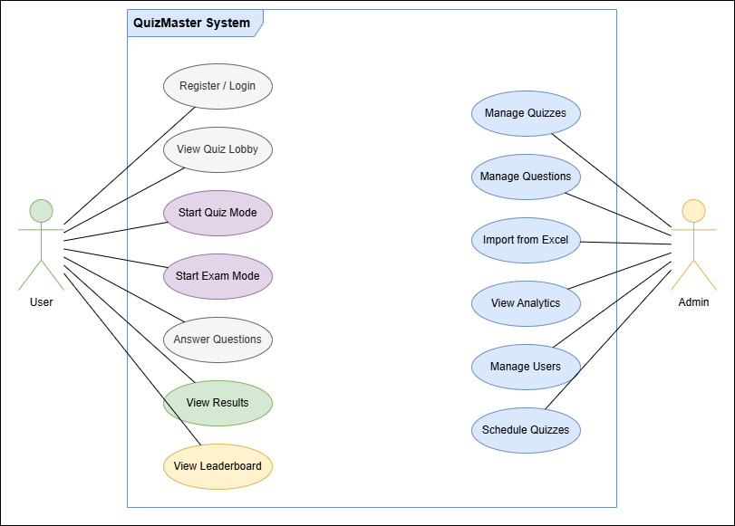
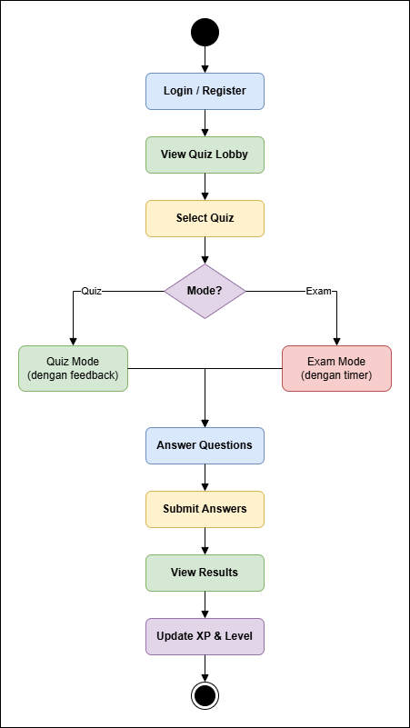
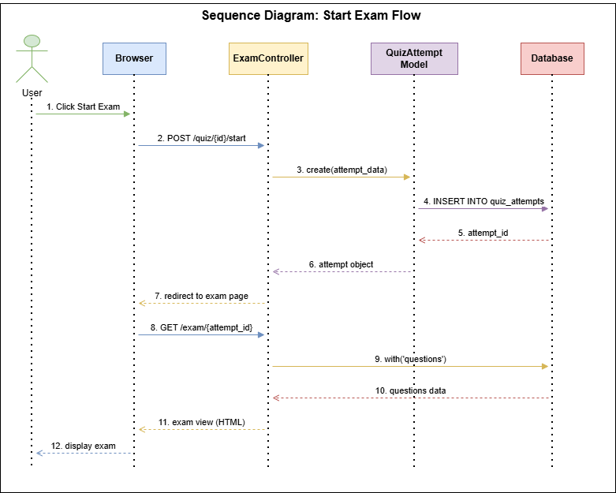
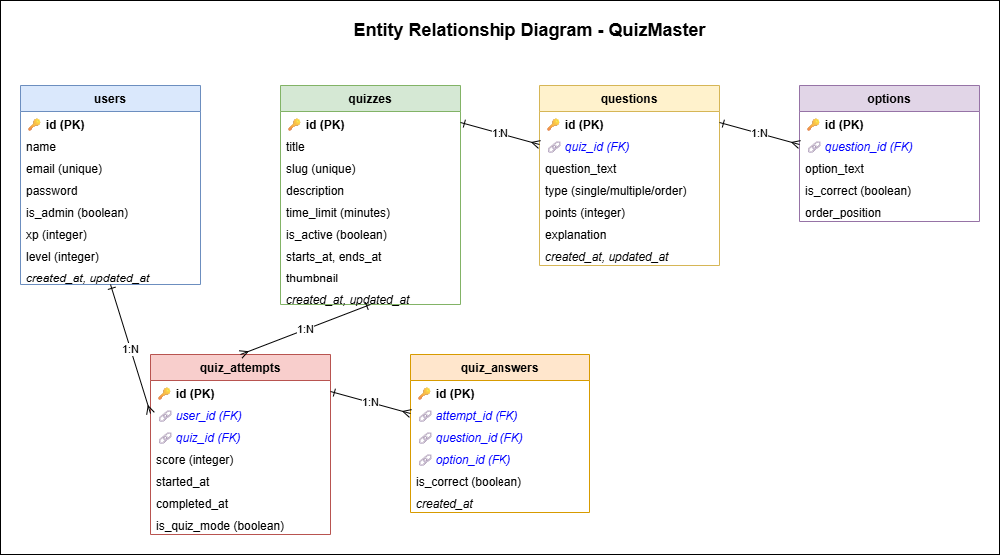
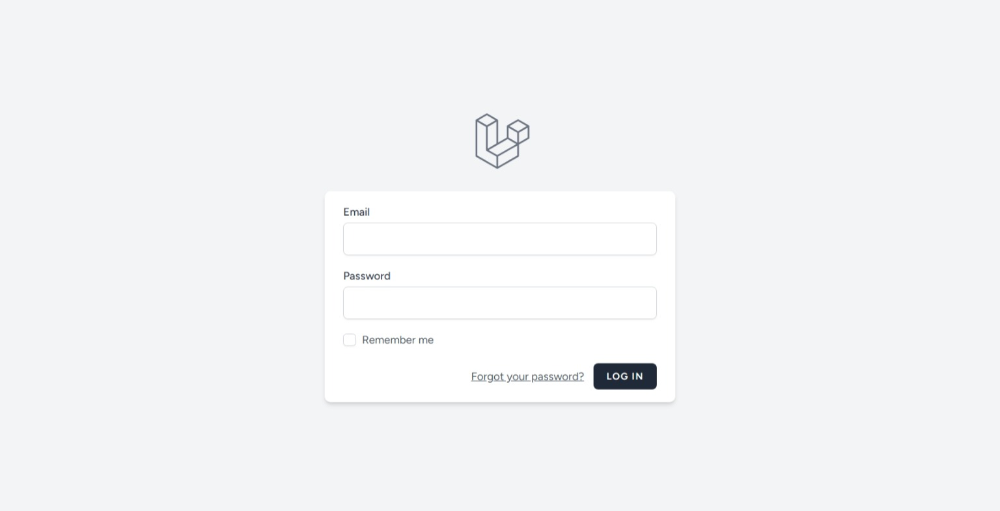
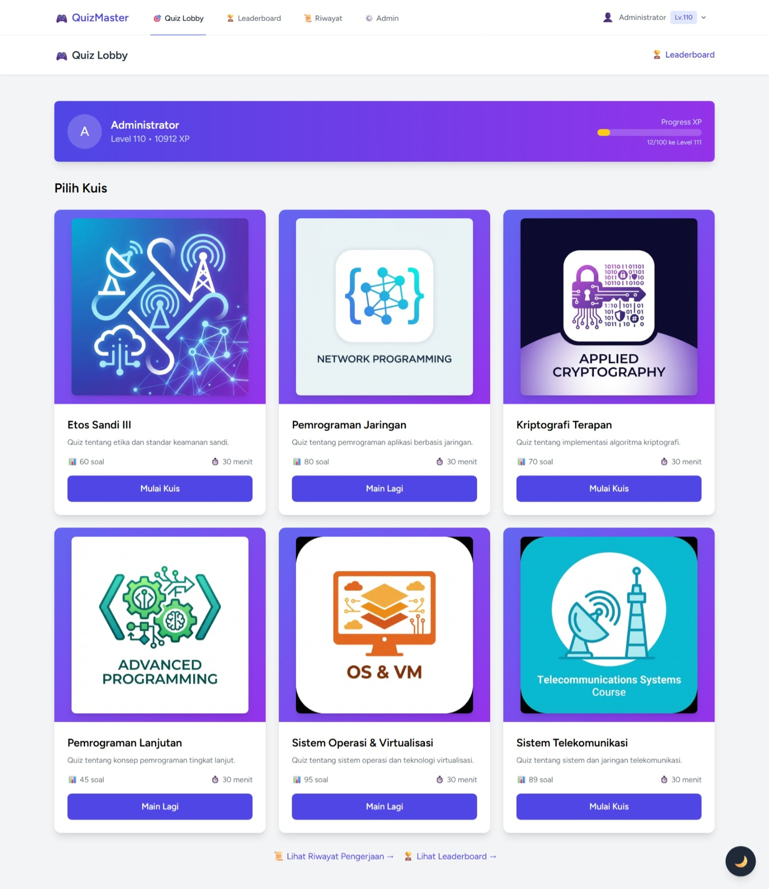
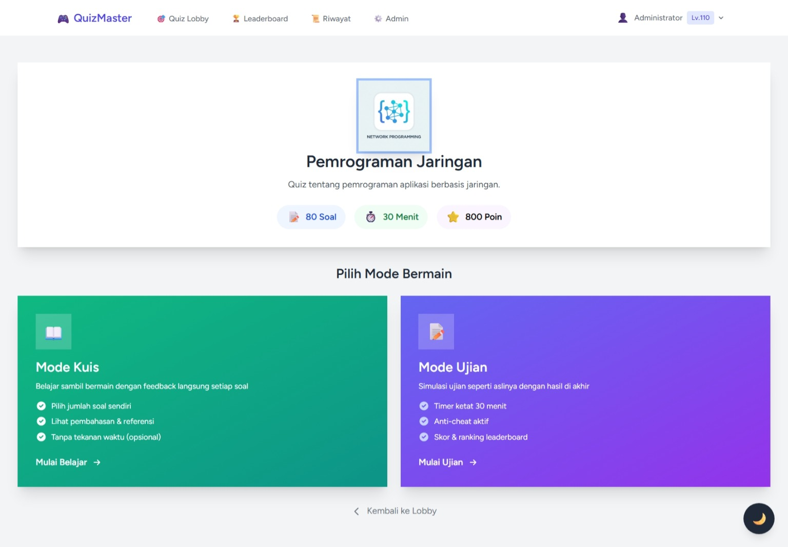
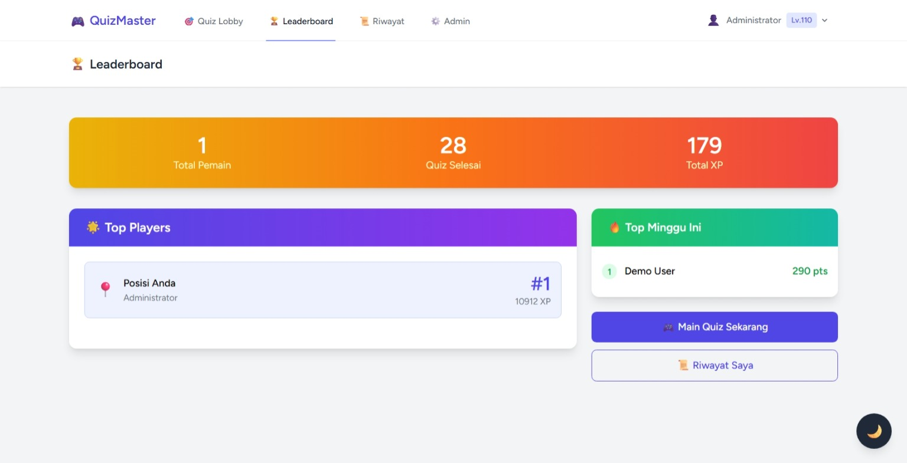
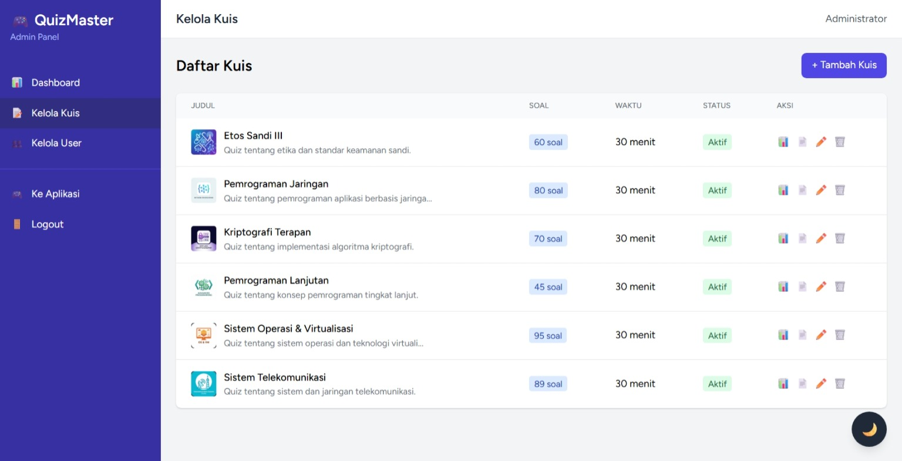
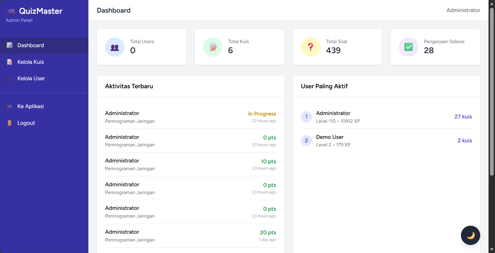

# 📚 Dokumentasi Project (Progress Report)

## QuizMaster - Platform Kuis Interaktif


---

## 📖 Deskripsi

QuizMaster adalah platform kuis interaktif berbasis web yang dirancang untuk membantu pengguna belajar melalui metode gamifikasi. Aplikasi ini menyediakan dua mode pengerjaan: **Mode Kuis** untuk latihan bebas dengan feedback langsung, dan **Mode Ujian** untuk simulasi ujian dengan timer ketat dan anti-cheat system.

### Tujuan Utama:
- Menyediakan platform pembelajaran interaktif
- Meningkatkan motivasi belajar melalui gamifikasi (XP, Level, Leaderboard)
- Memudahkan admin dalam mengelola bank soal dan analytics

### Tech Stack:
- **Backend:** Laravel 11
- **Frontend:** Blade + Alpine.js
- **Styling:** TailwindCSS
- **Database:** SQLite (dev) / MySQL (prod)
- **Build:** Vite

---

## 📋 User Story

| ID | User Story | Priority |
|----|------------|----------|
| US-01 | Sebagai user, saya ingin mengerjakan kuis dengan timer agar dapat melatih kemampuan manajemen waktu | High |
| US-02 | Sebagai user, saya ingin melihat pembahasan jawaban agar dapat belajar dari kesalahan | High |
| US-03 | Sebagai user, saya ingin melihat leaderboard untuk memotivasi diri | Medium |
| US-04 | Sebagai user, saya ingin mendapatkan XP dan level agar merasa tertantang | Medium |
| US-05 | Sebagai admin, saya ingin import soal dari Excel agar efisien | High |
| US-06 | Sebagai admin, saya ingin melihat analytics per kuis agar dapat evaluasi | Medium |
| US-07 | Sebagai admin, saya ingin menjadwalkan kuis agar terorganisir | Low |

---

## 📝 SRS - Feature List

### Functional Requirements

| ID | Feature | Deskripsi | Status |
|----|---------|-----------|--------|
| FR-01 | Authentication | Login, Register, Logout dengan Laravel Breeze | ✅ Done |
| FR-02 | Quiz Mode | Mode latihan dengan feedback per soal | ✅ Done |
| FR-03 | Exam Mode | Mode ujian dengan timer dan anti-cheat | ✅ Done |
| FR-04 | Question Types | Single choice, Multiple choice, Ordering | ✅ Done |
| FR-05 | Leaderboard | Ranking berdasarkan XP dan skor | ✅ Done |
| FR-06 | Gamification | XP, Level, Achievement badges | ✅ Done |
| FR-07 | Admin CRUD | Kelola Quiz, Soal, User | ✅ Done |
| FR-08 | Excel Import | Import soal dari file Excel | ✅ Done |
| FR-09 | Analytics | Statistik per kuis dan user | ✅ Done |
| FR-10 | Scheduling | Penjadwalan buka/tutup kuis | ✅ Done |
| FR-11 | Dark Mode | Toggle tema gelap/terang | ✅ Done |

### Non-Functional Requirements

| ID | Requirement | Deskripsi |
|----|-------------|-----------|
| NFR-01 | Performance | Load time < 3 detik |
| NFR-02 | Security | Rate limiting, input sanitization |
| NFR-03 | Usability | Responsive design, dark mode |
| NFR-04 | Reliability | Auto-save jawaban ke localStorage |

---

## 📊 UML Diagrams

### Use Case Diagram



### Activity Diagram - Quiz Flow



### Sequence Diagram - Start Exam



### ERD (Entity Relationship Diagram)



---

## 🎨 Mock-Up / Screenshots

### 1. Halaman Login


### 2. Halaman Register


### 3. Quiz Lobby


### 4. Mode Selection


### 5. Leaderboard


### 6. Admin Dashboard


### 7. Admin Quiz Management


---

## 🔄 SDLC (Software Development Life Cycle)

**Metodologi:** Agile - Iterative Development

| Phase | Aktivitas | Output |
|-------|-----------|--------|
| **1. Planning** | Requirement gathering, user story | PRD, User Stories |
| **2. Analysis** | SRS, feature prioritization | Feature List, SRS Doc |
| **3. Design** | UML diagrams, database design, mockups | UML, ERD, Mockups |
| **4. Development** | Coding, unit testing | Source code, tests |
| **5. Testing** | Integration testing, UAT | Test cases, bug reports |
| **6. Deployment** | Server setup, deployment | Live application |
| **7. Maintenance** | Bug fixes, feature updates | Patches, updates |

### Timeline

```
Minggu 1: Planning & Analysis
Minggu 2: Design (UML, Mockups)
Minggu 3-5: Development Sprint 1 (Core Features)
Minggu 6-7: Development Sprint 2 (Admin Features)
Minggu 8: Testing, Bug Fixes & Deployment
```

---

## 🚀 Instalasi

### Prerequisites

Pastikan Anda sudah menginstall:
- **PHP** >= 8.2
- **Composer** >= 2.0
- **Node.js** >= 18.0
- **NPM** >= 9.0
- **Git**

### Langkah 1: Clone Repository

```bash
git clone https://github.com/FalitoNGL/QuizMaster-app.git
cd QuizMaster-app
```

### Langkah 2: Install Dependencies

```bash
# Install PHP dependencies
composer install

# Install Node.js dependencies
npm install
```

### Langkah 3: Konfigurasi Environment

```bash
# Copy file environment
cp .env.example .env

# Generate application key
php artisan key:generate
```

**Edit file `.env`** dan sesuaikan konfigurasi database:

```env
DB_CONNECTION=sqlite
# atau untuk MySQL:
# DB_CONNECTION=mysql
# DB_HOST=127.0.0.1
# DB_PORT=3306
# DB_DATABASE=quizmaster
# DB_USERNAME=root
# DB_PASSWORD=
```

### Langkah 4: Setup Database

```bash
# Buat file database SQLite (jika menggunakan SQLite)
touch database/database.sqlite

# Jalankan migrasi dan seeder
php artisan migrate --seed

# Link storage untuk upload file
php artisan storage:link
```

### Langkah 5: Build Assets

```bash
# Build untuk production
npm run build

# atau untuk development (dengan hot reload)
npm run dev
```

### Langkah 6: Jalankan Server

```bash
php artisan serve
```

Aplikasi akan berjalan di: **http://localhost:8000**

### 🔐 Default Account

| Role | Email | Password |
|------|-------|----------|
| Admin | admin@quizmaster.com | password123 |
| User | user@quizmaster.com | password123 |

### ⚠️ Troubleshooting

| Error | Solusi |
|-------|--------|
| `SQLSTATE: no such table` | Jalankan `php artisan migrate:fresh --seed` |
| `Vite manifest not found` | Jalankan `npm run build` |
| `Permission denied` | Jalankan `chmod -R 775 storage bootstrap/cache` |
| `Class not found` | Jalankan `composer dump-autoload` |

---

## 📁 Struktur Database

```
users          → User accounts (with XP, level)
quizzes        → Quiz data (with scheduling)
questions      → Question bank
options        → Answer options
quiz_attempts  → User attempts
quiz_answers   → User answers
achievements   → Badge definitions
categories     → Quiz categories
```


---

## 📜 License

This project is licensed under the **MIT License** - see the [LICENSE](LICENSE) file for details.

---

## 👨‍💻 Author

**Falito Eriano Nainggolan**

---

⭐ Star this repo if you find it useful!
